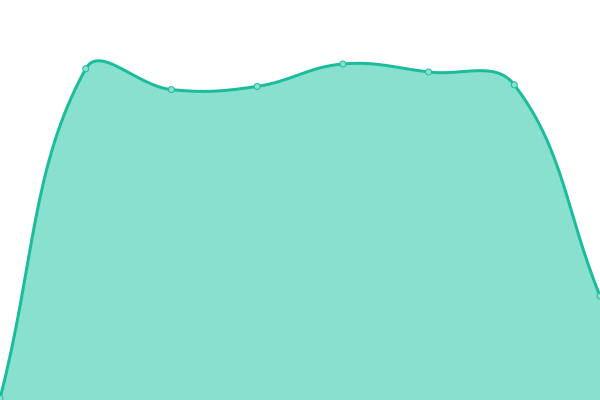

# [📈 Live Status](https://status.helloallan.com): <!--live status--> **🟩 All systems operational**

This repository contains the open-source uptime monitor and status page for [Allan](http://www.helloallan.com), powered by [Upptime](https://github.com/upptime/upptime).

With [Upptime](https://upptime.js.org), you can get your own unlimited and free uptime monitor and status page, powered entirely by a GitHub repository. We use [Issues](https://github.com/helloallan/upptime/issues) as incident reports, [Actions](https://github.com/helloallan/upptime/actions) as uptime monitors, and [Pages](https://status.helloallan.com) for the status page.

<!--start: status pages-->
<!-- This summary is generated by Upptime (https://github.com/upptime/upptime) -->
<!-- Do not edit this manually, your changes will be overwritten -->
<!-- prettier-ignore -->
| URL | Status | History | Response Time | Uptime |
| --- | ------ | ------- | ------------- | ------ |
|  [HelloAllan](https://www.helloallan.com) | 🟩 Up | [hello-allan.yml](https://github.com/outpostso/upptime/commits/HEAD/history/hello-allan.yml) | 

 664ms
     
 | 

<a href="https://status.helloallan.com/history/hello-allan">100.00%</a>
    

|  [EmptyChair App](https://web.emptychair.app) | 🟩 Up | [empty-chair-app.yml](https://github.com/outpostso/upptime/commits/HEAD/history/empty-chair-app.yml) | 

 690ms
     
 | 

<a href="https://status.helloallan.com/history/empty-chair-app">0.02%</a>
    

|  [EmptyChair Api](https://api.emptychair.app/healthz) | 🟩 Up | [empty-chair-api.yml](https://github.com/outpostso/upptime/commits/HEAD/history/empty-chair-api.yml) | 

 560ms
     
 | 

<a href="https://status.helloallan.com/history/empty-chair-api">100.00%</a>
    

|  [EmptyChair Marketing](https://emptychair.app) | 🟩 Up | [empty-chair-marketing.yml](https://github.com/outpostso/upptime/commits/HEAD/history/empty-chair-marketing.yml) | 

 704ms
     
 | 

<a href="https://status.helloallan.com/history/empty-chair-marketing">0.20%</a>
    

|  [AfterParty Marketing](https://afterparty.chat) | 🟩 Up | [after-party-marketing.yml](https://github.com/outpostso/upptime/commits/HEAD/history/after-party-marketing.yml) | 

 685ms
     
 | 

<a href="https://status.helloallan.com/history/after-party-marketing">100.00%</a>
    

|  [Grit](https://trygrit.ai) | 🟩 Up | [grit.yml](https://github.com/outpostso/upptime/commits/HEAD/history/grit.yml) | 

 476ms
     
 | 

<a href="https://status.helloallan.com/history/grit">100.00%</a>
    

|  [Grit App](https://app.trygrit.ai) | 🟩 Up | [grit-app.yml](https://github.com/outpostso/upptime/commits/HEAD/history/grit-app.yml) | 

 345ms
     
 | 

<a href="https://status.helloallan.com/history/grit-app">100.00%</a>
    

|  [AllRoads Dev](https://allroads.dev) | 🟩 Up | [all-roads-dev.yml](https://github.com/outpostso/upptime/commits/HEAD/history/all-roads-dev.yml) | 

 688ms
     
 | 

<a href="https://status.helloallan.com/history/all-roads-dev">100.00%</a>
    

|  [AllRoads To](https://app.allroads.to) | 🟩 Up | [all-roads-to.yml](https://github.com/outpostso/upptime/commits/HEAD/history/all-roads-to.yml) | 

 646ms
     
 | 

<a href="https://status.helloallan.com/history/all-roads-to">24.60%</a>
    

<!--end: status pages-->

[**Visit our status website →**](https://status.helloallan.com)

## 📄 License

- Powered by: [Upptime](https://github.com/upptime/upptime)
- Code: [MIT](./LICENSE) © [Allan](http://www.helloallan.com)
- Data in the `./history` directory: [Open Database License](https://opendatacommons.org/licenses/odbl/1-0/)
